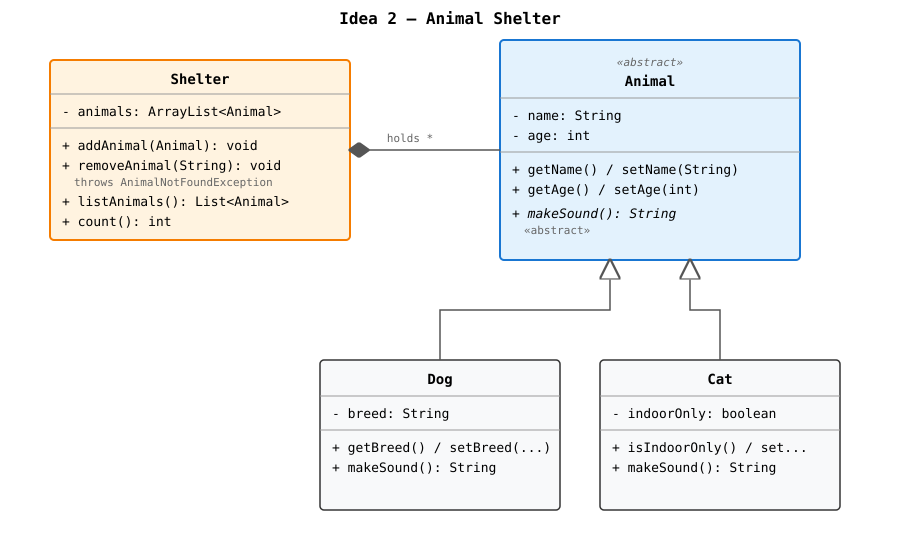

# Mini-Project Ideas — Foundational OOP (Java)

Four simple project ideas that all meet the exam criteria:

- 3+ classes
- Setters and getters
- ArrayList holding a list of objects
- Abstract class with at least **2 subclasses**
- JavaFX GUI with manually coded layout + buttons
- Exception handling (try-catch + custom exception)
- JavaDoc on all methods

---

## Idea 1 — Library

A library where you can add, remove and list books and magazines.


<details>
<summary>ASCII version</summary>

```
        ┌──────────────────────┐
        │   <<abstract>>       │
        │   LibraryItem        │
        ├──────────────────────┤
        │ - title: String      │
        │ - year: int          │
        ├──────────────────────┤
        │ + getTitle()/set...  │
        │ + getYear()/set...   │
        │ + describe(): String │ <-- abstract
        └──────────▲───────────┘
                   │ extends
        ┌──────────┴───────────┐
        │                      │
┌───────┴────────┐    ┌────────┴────────┐
│ Book           │    │ Magazine        │
├────────────────┤    ├─────────────────┤
│ - author       │    │ - issueNumber   │
├────────────────┤    ├─────────────────┤
│ + getAuthor()  │    │ + getIssueNo()  │
│ + describe()   │    │ + describe()    │
└────────────────┘    └─────────────────┘

┌────────────────────────────────┐
│ Library                        │
├────────────────────────────────┤
│ - items: ArrayList<LibraryItem>│
├────────────────────────────────┤
│ + addItem(LibraryItem)         │
│ + removeItem(int) throws ...   │
│ + getAllItems()                │
└────────────────────────────────┘

┌────────────────────────────────┐
│ MainApp (JavaFX)               │
│ Buttons: Add Book / Add Magazine / Remove / Show all
└────────────────────────────────┘
```

**Custom exception:** `ItemNotFoundException` when removing an item that doesn't exist.

</details>

---

## Idea 2 — Animal Shelter

A shelter where you register dogs and cats and see them in a list.



<details>
<summary>ASCII version</summary>

```
        ┌──────────────────────┐
        │   <<abstract>>       │
        │   Animal             │
        ├──────────────────────┤
        │ - name: String       │
        │ - age: int           │
        ├──────────────────────┤
        │ + getName()/set...   │
        │ + getAge()/set...    │
        │ + makeSound(): String│ <-- abstract
        └──────────▲───────────┘
                   │
        ┌──────────┴───────────┐
        │                      │
┌───────┴────────┐    ┌────────┴────────┐
│ Dog            │    │ Cat             │
├────────────────┤    ├─────────────────┤
│ - breed        │    │ - indoorOnly    │
├────────────────┤    ├─────────────────┤
│ + getBreed()   │    │ + isIndoorOnly()│
│ + makeSound()  │    │ + makeSound()   │
└────────────────┘    └─────────────────┘

┌────────────────────────────────┐
│ Shelter                        │
├────────────────────────────────┤
│ - animals: ArrayList<Animal>   │
├────────────────────────────────┤
│ + addAnimal(Animal)            │
│ + removeAnimal(name) throws... │
│ + listAnimals()                │
└────────────────────────────────┘
```

**Custom exception:** `AnimalNotFoundException`. Good spot for try-catch on input validation (age can't be negative).

</details>

---

## Idea 3 — Music Playlist

A playlist that holds songs and albums.


<details>
<summary>ASCII version</summary>

```
        ┌──────────────────────┐
        │   <<abstract>>       │
        │   MusicItem          │
        ├──────────────────────┤
        │ - title: String      │
        │ - artist: String     │
        ├──────────────────────┤
        │ + getters/setters    │
        │ + getDuration(): int │ <-- abstract (minutes)
        └──────────▲───────────┘
                   │
        ┌──────────┴───────────┐
        │                      │
┌───────┴────────┐    ┌────────┴────────┐
│ Song           │    │ Album           │
├────────────────┤    ├─────────────────┤
│ - lengthMin    │    │ - trackCount    │
│                │    │ - avgTrackMin   │
├────────────────┤    ├─────────────────┤
│ + getLength()  │    │ + getTrackCount │
│ + getDuration()│    │ + getDuration() │
└────────────────┘    └─────────────────┘

┌────────────────────────────────┐
│ Playlist                       │
├────────────────────────────────┤
│ - items: ArrayList<MusicItem>  │
├────────────────────────────────┤
│ + add(MusicItem)               │
│ + remove(title) throws ...     │
│ + totalDuration(): int         │
└────────────────────────────────┘
```

**Custom exception:** `ItemNotFoundException` when removing.

</details>

---

## Idea 4 — To-do List with Task Types

A simple todo-app with two task types: simple tasks and tasks with a deadline.


<details>
<summary>ASCII version</summary>

```
        ┌──────────────────────┐
        │   <<abstract>>       │
        │   Task               │
        ├──────────────────────┤
        │ - description        │
        │ - done: boolean      │
        ├──────────────────────┤
        │ + getters/setters    │
        │ + summary(): String  │ <-- abstract
        └──────────▲───────────┘
                   │
        ┌──────────┴───────────┐
        │                      │
┌───────┴────────┐    ┌────────┴───────────┐
│ SimpleTask     │    │ DeadlineTask       │
├────────────────┤    ├────────────────────┤
│ (no extras)    │    │ - deadline: String │
├────────────────┤    ├────────────────────┤
│ + summary()    │    │ + getDeadline()    │
│                │    │ + summary()        │
└────────────────┘    └────────────────────┘

┌────────────────────────────────┐
│ TaskList                       │
├────────────────────────────────┤
│ - tasks: ArrayList<Task>       │
├────────────────────────────────┤
│ + addTask(Task)                │
│ + markDone(index) throws...    │
│ + removeTask(index)            │
└────────────────────────────────┘
```

**Custom exception:** `InvalidTaskIndexException`.

</details>

---

## Recommendation

All four ideas meet every exam requirement.

**Easiest to explain at the oral exam:** Idea 2 (Animal Shelter) or Idea 1 (Library) — the domain is concrete and easy to talk about.

**Next step:** Pick one, then we design the GUI layout and the file structure.
