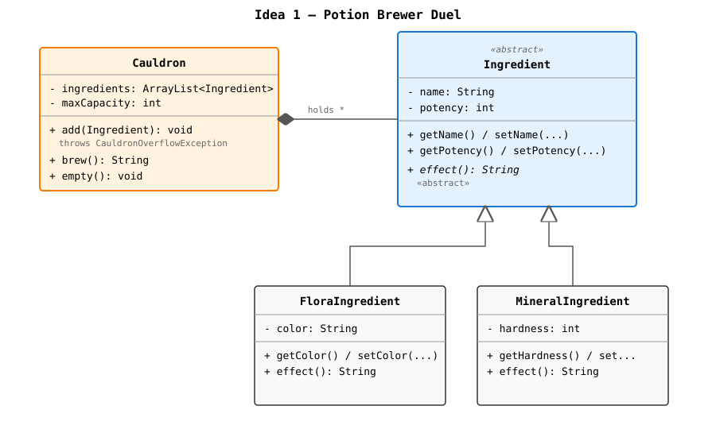
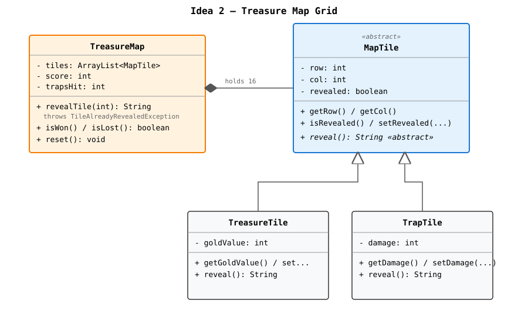
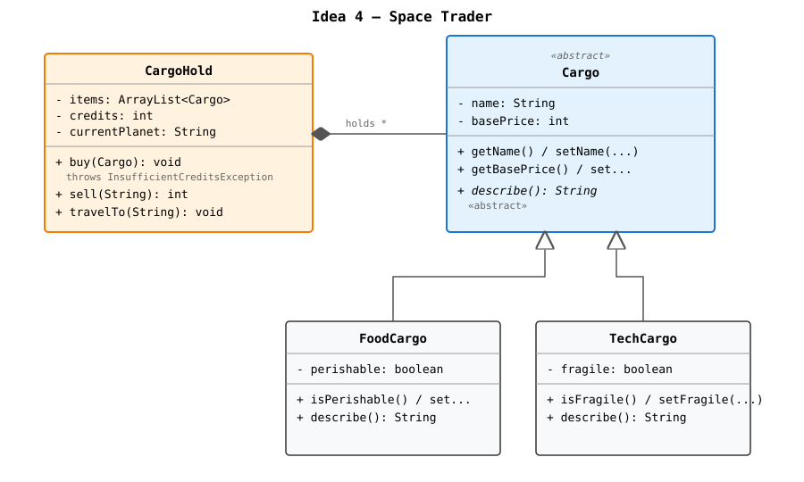

# Mini-Project Ideas — Round 2 (Games)

Four **original game ideas** that all meet the exam criteria:

- 3+ classes
- Setters and getters
- ArrayList holding a list of objects
- Abstract class with at least **2 subclasses**
- JavaFX GUI with manually coded layout + buttons
- Exception handling (try-catch + custom exception)
- JavaDoc on all methods

All four are turn-based, button-driven games — no real-time keyboard handling
needed. That keeps the JavaFX side simple while still feeling like a game.

---

## Idea 1 — Potion Brewer Duel

You're an apprentice alchemist in a magic duel. Drag ingredients into your
cauldron, brew a potion, and use it to weaken your rival. The opponent does
the same. Best brewer wins.



<details>
<summary>ASCII version</summary>

```
        ┌──────────────────────┐
        │   <<abstract>>       │
        │   Ingredient         │
        ├──────────────────────┤
        │ - name: String       │
        │ - potency: int       │
        ├──────────────────────┤
        │ + getters/setters    │
        │ + effect(): String   │ <-- abstract
        └──────────▲───────────┘
                   │
        ┌──────────┴───────────┐
        │                      │
┌───────┴────────┐    ┌────────┴───────────┐
│ FloraIngredient│    │ MineralIngredient  │
├────────────────┤    ├────────────────────┤
│ - color        │    │ - hardness         │
├────────────────┤    ├────────────────────┤
│ + getColor()   │    │ + getHardness()    │
│ + effect()     │    │ + effect()         │
└────────────────┘    └────────────────────┘

┌─────────────────────────────────────────┐
│ Cauldron                                │
├─────────────────────────────────────────┤
│ - ingredients: ArrayList<Ingredient>    │
│ - maxCapacity: int                      │
├─────────────────────────────────────────┤
│ + add(Ingredient) throws ...            │
│ + brew(): String                        │
│ + empty(): void                         │
└─────────────────────────────────────────┘
```

</details>

**Custom exception:** `CauldronOverflowException` when the cauldron is full.
**Buttons:** *Add Flora / Add Mineral / Brew / Throw at Rival / Empty Cauldron*.

---

## Idea 2 — Treasure Map Grid

A 4×4 grid of mystery tiles. Click a tile to reveal it. Some hide treasure
(collect them all to win). Some hide traps (3 traps and you lose).



<details>
<summary>ASCII version</summary>

```
        ┌──────────────────────┐
        │   <<abstract>>       │
        │   MapTile            │
        ├──────────────────────┤
        │ - row: int           │
        │ - col: int           │
        │ - revealed: boolean  │
        ├──────────────────────┤
        │ + getters/setters    │
        │ + reveal(): String   │ <-- abstract
        └──────────▲───────────┘
                   │
        ┌──────────┴───────────┐
        │                      │
┌───────┴────────┐    ┌────────┴────────┐
│ TreasureTile   │    │ TrapTile        │
├────────────────┤    ├─────────────────┤
│ - goldValue    │    │ - damage        │
├────────────────┤    ├─────────────────┤
│ + getValue()   │    │ + getDamage()   │
│ + reveal()     │    │ + reveal()      │
└────────────────┘    └─────────────────┘

┌─────────────────────────────────────────┐
│ TreasureMap                             │
├─────────────────────────────────────────┤
│ - tiles: ArrayList<MapTile>             │
│ - score: int                            │
│ - trapsHit: int                         │
├─────────────────────────────────────────┤
│ + revealTile(int) throws ...            │
│ + isWon(): boolean                      │
│ + isLost(): boolean                     │
│ + reset(): void                         │
└─────────────────────────────────────────┘
```

</details>

**Custom exception:** `TileAlreadyRevealedException` when clicking a tile
that's already been opened.
**Buttons:** the 16 grid tiles are buttons + a *Restart Map* button.

---

## Idea 3 — Ghost Hunter Logbook

You're a paranormal investigator. Each turn a random ghost shows up. You
choose to *Capture* (adds to logbook) or *Banish* (removes from world). Build
a famous logbook before time runs out.


<details>
<summary>ASCII version</summary>

```
        ┌──────────────────────┐
        │   <<abstract>>       │
        │   Ghost              │
        ├──────────────────────┤
        │ - name: String       │
        │ - difficulty: int    │
        ├──────────────────────┤
        │ + getters/setters    │
        │ + haunt(): String    │ <-- abstract
        └──────────▲───────────┘
                   │
        ┌──────────┴───────────┐
        │                      │
┌───────┴────────┐    ┌────────┴────────┐
│ Poltergeist    │    │ Phantom         │
├────────────────┤    ├─────────────────┤
│ - chaosLevel   │    │ - transparency  │
├────────────────┤    ├─────────────────┤
│ + getChaos()   │    │ + getTransp()   │
│ + haunt()      │    │ + haunt()       │
└────────────────┘    └─────────────────┘

┌─────────────────────────────────────────┐
│ HauntedLogbook                          │
├─────────────────────────────────────────┤
│ - capturedGhosts: ArrayList<Ghost>      │
│ - reputation: int                       │
├─────────────────────────────────────────┤
│ + capture(Ghost) throws ...             │
│ + banish(String name): void             │
│ + getMostFamous(): Ghost                │
│ + getReputation(): int                  │
└─────────────────────────────────────────┘
```

</details>

**Custom exception:** `GhostTooStrongException` when a ghost's difficulty
exceeds your current reputation.
**Buttons:** *Investigate (spawn ghost) / Capture / Banish / Show Logbook*.

---

## Idea 4 — Space Trader

Pilot a tiny cargo ship between 3 planets. Buy cargo cheap, fly to another
planet, sell it expensive. Don't overspend or overload your hold.



<details>
<summary>ASCII version</summary>

```
        ┌──────────────────────┐
        │   <<abstract>>       │
        │   Cargo              │
        ├──────────────────────┤
        │ - name: String       │
        │ - basePrice: int     │
        ├──────────────────────┤
        │ + getters/setters    │
        │ + describe(): String │ <-- abstract
        └──────────▲───────────┘
                   │
        ┌──────────┴───────────┐
        │                      │
┌───────┴────────┐    ┌────────┴────────┐
│ FoodCargo      │    │ TechCargo       │
├────────────────┤    ├─────────────────┤
│ - perishable   │    │ - fragile       │
├────────────────┤    ├─────────────────┤
│ + isPerish...  │    │ + isFragile()   │
│ + describe()   │    │ + describe()    │
└────────────────┘    └─────────────────┘

┌─────────────────────────────────────────┐
│ CargoHold                               │
├─────────────────────────────────────────┤
│ - items: ArrayList<Cargo>               │
│ - credits: int                          │
│ - currentPlanet: String                 │
├─────────────────────────────────────────┤
│ + buy(Cargo) throws ...                 │
│ + sell(String name): int                │
│ + travelTo(String planet): void         │
│ + totalValue(): int                     │
└─────────────────────────────────────────┘
```

</details>

**Custom exception:** `InsufficientCreditsException` when trying to buy
something you can't afford.
**Buttons:** *Buy Food / Buy Tech / Sell / Travel to Mars / Travel to Venus /
Travel to Earth*.

---

## Recommendation

**Idea 2 (Treasure Map Grid)** is the most beginner-friendly — the GUI is
literally a 4×4 grid of buttons, each button is one tile, and the game loop
is "click a tile → call `revealTile(index)` → catch exception → update label".
Easy to explain at the oral exam, and visually satisfying.

**Idea 3 (Ghost Hunter)** is the most fun and most original-feeling if you
want a story-flavored project.

Pick one and we design the GUI layout + file structure next.
